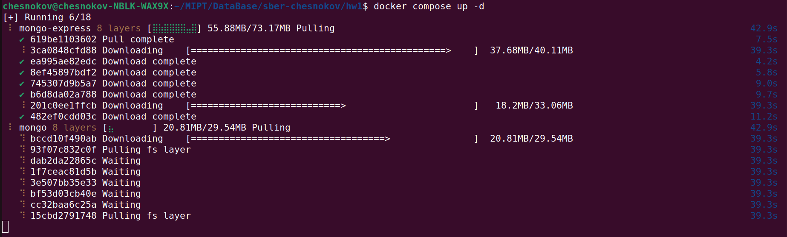
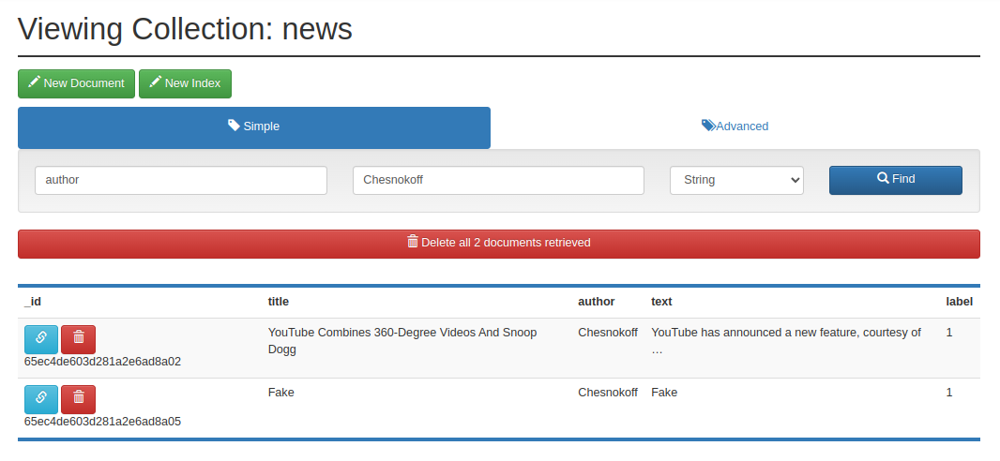
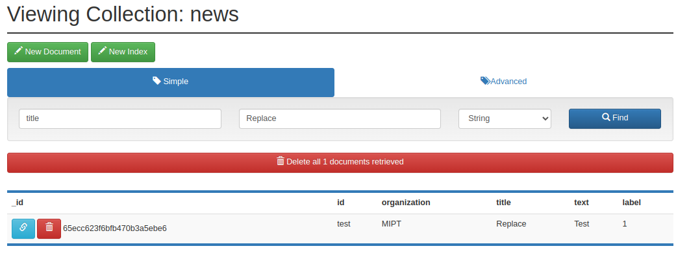

# Работа с MondoDb
В данной домашней работе необходимо поиграться MongoDB. В качестве данных взят
датасет по фейковым новостям с [Kaggle](https://www.kaggle.com/competitions/fake-news/).

## Подготовка

1) Скачал [датасет](https://www.kaggle.com/competitions/fake-news/data?select=train.csv) 
про фейковые новости с Kaggle
2) Создал _docker-compose.yml_ который запускает mongo и mongo-express и запустил его
`docker compose up -d`

3) С помощью _prepare.py_ создаю Database news и в ней коллекцию news.
Если такая Database уже была, то она сбрасывается и пересоздается заново.
Запуск через `python3 prepare.py`
4) На http://localhost:8081/ проверяю что действительно данные внесены

## Играемся с CRUD
Далее в каждой папке C, R, U, D будут скрипты с соответствующими операциями

### Create

Выполняем скрипт insert.py и проверяем что действительно все вставилось

insert_one и insert_many работают. Не знаю что еще добавить

### Read
Запускаю скриптик russia.py, и получаю
> Всего 762 новостей о России, из них 480 ложные и 282 достоверные

Ну и в добавок интересный списочек с помощью find) Тоже пока ничто не
впечатлило

### Update
А вот тут уже поинтереснее. Главный вопрос, который меня мучил: отличие update
от replace. Давайте узнаем. В replace_and_update.py сначала делаем insert двух
похожих данных, затем по одному из них делаем replace, а по другому - update.

Итог такой: replace полностью удаляет найденную запись и делает новую, в то
время как update нужен именно для _модификации_ полей.

### Delete
Запустил скрипт delete.py, тут особо говорить не о чем.

### Stress tests
Полезно сделать некоторые замеры по времени, чтобы потом было с чем сравнивать
в следующих СУБД. Делать правильный бенчмарк - целая наука, здесь будем
использовать самый примитивный вариант с time.time()

Сделаем в inserts.py 10к вставок: `TIME: 6.093255996704102`

А теперь снова перезапустим БД и попробуем поиск по ключу и без в index.py:
`TIME TO SEARCH WITHOUT INDEX: 0.06957721710205078`

`TIME TO SEARCH WITH INDEX: 0.03310227394104004`

В целом, на таком маленьком времени сложно судить о времени работы, но в случае
работы с индексом программа работает чуть быстрее (Хотя я сам сейчас много
изучаю материалов по бенчмарку в Java для одного НИР и понимаю, что там может
оказаться какое-нибудь кэширование данных и надо делать все по науке)

# Итоги
В целом, прикольная СУБД, мне понравилась. Действительно полная свобода и
анархия в плане вставок. Однако отсутствие жестких
рамок на конкретные поля у данных (в плане что в одной коллекции разные документы
могут быть совершенно разные по структуре) прям сразу вызывает опасения
