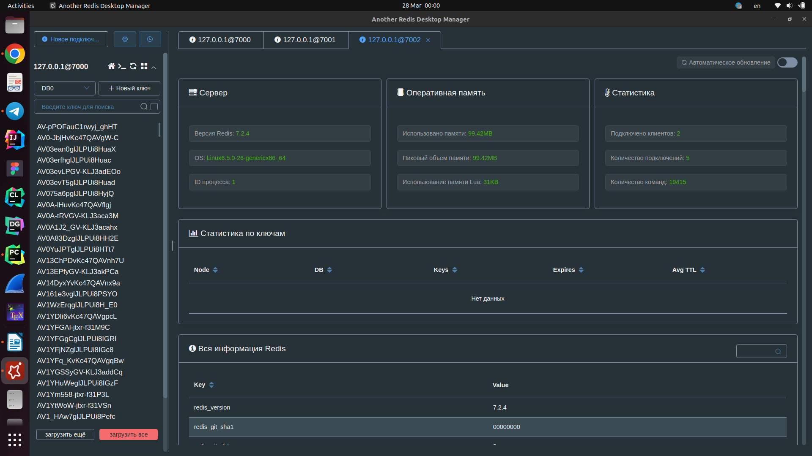

# Redis
## Условие

**Цель**: 
В результате выполнения ДЗ вы научитесь разворачивать Redis в кластере, заполнять данными и делать запросы.

Инструкция выполнения домашнего задания:
1. Сохранить большой JSON (~20МБ) в виде разных структур - строка, hset, zset, list;
2. Протестировать скорость сохранения и чтения;
3. Настроить редис кластер на 3х нодах с отказоустойчивостью, затюнить таймауты.
4. Предоставить отчет.

## Данные
Идем на страницу data.world и скачиваем
[датасет об электронике](https://data.world/datafiniti/electronic-products-and-pricing-data)
на 90 MB в формате CSV и с помощью pandas конвертируем в JSON.

Для визуализации используем Another Redis Desktop Manager



## Запуск Redis

Для запуска одной ноды достаточно использовать команду
`docker run --name some-redis -d redis`

В случае запуска кластера на нескольких все становится в разы сложнее. Для этого
создаем шесть директорий 7000-70005 в каждой из которых лежит redis.config для
конфигурации соответствующей ноды. Далее поскольку мне лень печатать команды в консоль,
создадим docker-compose.yml. По сути, главная команда тут это 
`redis-cli -p 7000 --cluster create redis-node-1:7000 redis-node-2:7001 redis-node-3:7002 redis-node-4:7003 redis-node-5:7004 redis-node-6:7005 --cluster-replicas 1 --cluster-yes`.
Получаем три master ноды и три slave ноды. Примечательно, что есть ограничение 
снизу на три master ноды.

## Загрузка БД в ноды

Как говорили великие 
> Никогда не тратьте 6 минут, чтобы сделать что-то вручную, когда вы можете потратить 6 часов,
> безуспешно пытаясь это автоматизировать.

Поэтому автоматизируем как можем. Для этого используем питон. В initial.ipynb
лежит код по загрузке датасета.

```python 
for item in items:
    rc.set(item['id'], json.dumps(item))
    rc.hset(name='hset_' + item['id'], mapping=item)
    rc.lpush('devices', json.dumps(item))
    rc.zadd('sorted_set_devices', {item['id']: item['prices.amountMin']})
```
Думаю, тут нет нужды в дополнительных комментариях.

## Бенчмарк
Как я уже говорил (пишу с научруком проект на Java и нужно было делать замеры
времени), бенчмарк - дело неблагодарное. Если использовать в тупую time.time()
в начале и в конце программы и вычитать, то это очень нехороший результат в том
смысле, что под капотом могут срабатывать разные оптимизации или кеширование, а могут
и не срабатывать. Поэтому при повторении эксперимента все может сильно измениться.

Поэтому лучше использовать команду `redis-benchmark -q` которая
сделает сто тысяч запросов и норм сделает замеры. Полный вывод в txt файлах,
здесь приведу лишь основную информацию. Информация в ячеках дана в запросах в секунду

| Состояние                | Set   | Get   | LPUSH | LPOP  | HSET  | ZADD  | ZPOPMIN |
|--------------------------|-------|-------|-------|-------|-------|-------|---------|
| Одна пустая вершина      | 48923 | 51255 | 51466 | 49603 | 49212 | 51466 | 49776   |
| Одна заполненная вершина | 51282 | 51255 | 50968 | 51255 | 50658 | 49188 | 49236   |
| Кластер без данных       | 40816 | 40833 | 35248 | 40650 | 40783 | 38819 | 37243   |
| Кластер с данными        | 40176 | 40387 | 40112 | 40273 | 39808 | 40290 | 40766   |

Получился довольно интересный результат:
1) Одна заполненная вершина работает даже чутка быстрее чем пустая. Вероятно, это связано с тем
что вершина как бы "прогревается" и поэтому новые запросы делаются быстрее. В целом же
наблюдается равенство по скорости, что похоже на правду так как операции делаются в оперативке
2) Как и ожидалось, работа с кластером работает дольше чем с одной вершиной, так как нужно делать больше операций
на каждый запрос (правильно распределять работу на шести вершинах)
3) В рамках кластера снова видим что нет весомой разницы между пустым и заполненным состоянием, что снова можно
пояснить работой на оперативной памяти

Теперь я проникся, почему в анализе данных предпочитают эту СУБД:
действительно мы можем пихать кучу данных, не переживая о производительности, в то время
как "безопасность" данных нам не так важна.
Еще и много полезных операций для анализа, как например zadd.
