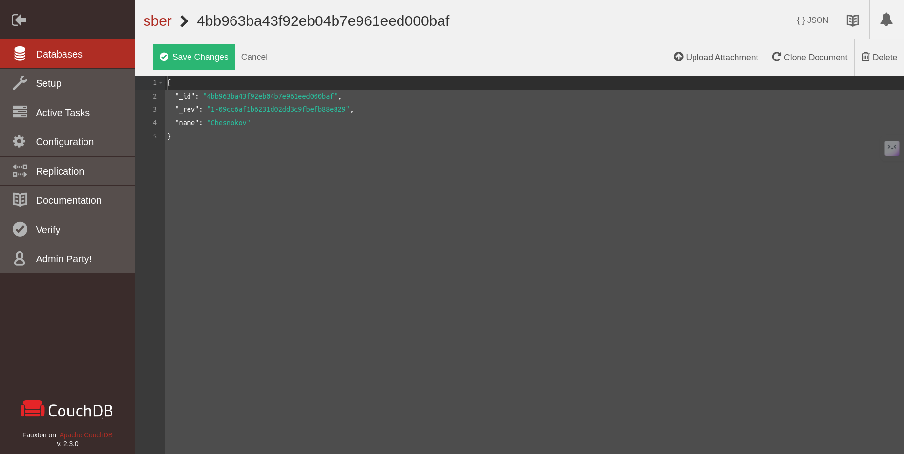
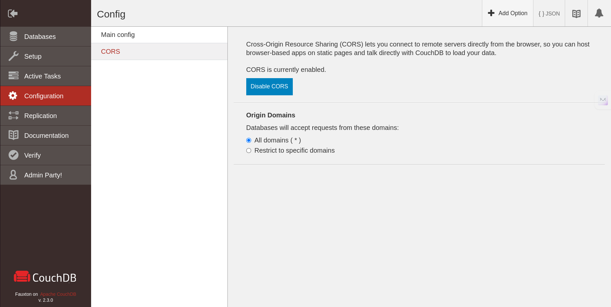
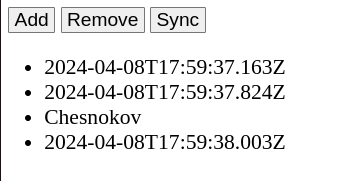

# CouchDB
Запускаем команду `docker run -itd -p 5984:5984 --name=couchdb couchdb:2.3.0`
(версия couchdb:latest почему-то не сработала). Идем в `http://127.0.0.1:5984/_utils/`
и создаем новый документ `sber`.

Далее самое главное, из-за чего я потратил три часа: идем в настройки и включаем
CORS как на картинке ниже

Теперь открываем исходный html, предварительно заменив строку 25 на 
`Remote: new PouchDB('http://localhost:5984/sber')`
Кликаем на sync и видим фамилию вместе с каким-то мусором. Победа

## [Ссылка на github pages](https://chesnokoff.github.io/db_sber/)
