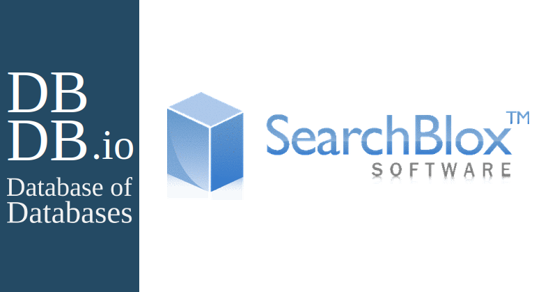

# SearchBlox database

**Цель:**

Научиться разбираться в любой СУБД зная только ее название.

# Модель Search Engine

Для начала надо проникнуться философией Search Engine Database, По этому поводу довольно мало статей в Интернете, однако нашел одну содержательную [статью от создателей algolia](https://www.algolia.com/blog/product/what-is-a-search-engine-database/), которая дает развернутое определение:

`A search engine database is a database that’s equipped with search functionality. Search features help you quickly find information in the database. Plus, this search engine is optimized for large volumes of data (such as what you’d find if you’re doing an academic search in a research database) that is either semi-structured or unstructured.`

`A search engine database is also a type of NoSQL database or non-relational database.`

Необходимость в таких СУБД тоже понятна. Например, когда мы вбиваем что-то в поисковик (в тот же Гугл), мы хотим, чтобы

1. Были некоторые подсказки в виде автодополнения или **похожих** запросов
2. Это самое автодополнение было бы **быстрым**. Ведь подсказка в виде автодополнения должна приходить быстро, чтобы пользователь не успел набрать свой запрос

В качестве затравки приведу задачи, которые хорошо решают Search Engine СУБД:

1. Full-text search, Full здесь как раз означает, что будут искаться не только точные результаты, но и похожие. Это полезно, например, если в слове из запроса есть опечатка
2. Geolocation search. В базе данных поисковой системы есть функция, называемая поиском по геолокации. Вы можете увидеть эту функцию в действии, если используете такие приложения, как Google Maps, и ищете что-то в определенном географическом радиусе. В стандартной базе данных для реализации поиска по геолокации требуется плагин

Теперь рассмотрим общий принцип, по которому работают Search Engine СУБД ([взято из статьи с habr](https://habr.com/ru/companies/amvera/articles/754702/)):

`Представим, что у вас есть N петабайт логов (или других текстовых данных). Обычный поиск по словам уже не подойдет, чтобы осуществить поиск и аналитику в разумное время.`

`На помощь приходит индексирование. Если очень утрировано его рассмотреть, можно его представить следующим способом. Каждому слову/лемме/n-грамме присвоим индекс и запишем эти индексы в специальную таблицу, где строки, это документ, а в столбики это индексы. Похожая система используется для построения систем поиска плагиата, правда там чаще применяют не слова, а шинглы (индексы с наслоением).`

Примеры Search Engine СУБД:

- Solr
- Xapian
- Algolia
- Sphinx
- Manticore Search
- SearchBlox
- Elasticsearch
- Solr
- OpenSearch
- Coveo
- т. д.

Далее рассмотрим SearchBlox

# SearchBlox

1. **История развития СУБД.** SearchBlox — поставщик решений корпоративного поиска на базе Apache Lucene/Solr. Более 300 клиентов в 30 странах используют SearchBlox для своих веб-сайтов и пользовательского поиска. Компания SearchBlox Software, Inc. была основана в 2003 году с целью разработки коммерческих поисковых продуктов на базе Apache Lucene/Solr. В [рейтинге от db-engines](https://db-engines.com/en/ranking) занимает 269 место, причем постоянно опускается в рейтинге. В целом, печально смотреть на данную БД, так как вообще нет каких либо обзоров на нее кроме как от создателей. Хотя можно найти пару-тройку хороших отзывов на нее. Людям нравится, что это по сути готовое решение для бизнеса, которое имеет кучу NLP-сервисов по типу чат-бота или собственный поисковик
   
   Вот примеры того что умеет данная БД
   
   - It crawls Filesystems, Web and RSS Feeds, Emails.
   
   - Search the intranet to find content from your share drives, repositories, custom applications and rss feeds.
   
   - Search box could be added to your website to help your users find information on your website.
   
   - Geo location based search, searching for information near an address, zip code or landmark.
   
   - Faceted Search
   
   - Mobile Search support, search information that is available through the website is also available on mobile devices.
   
   - Facebook/Twitter/Widget Integration.
   
   - Email alerts on new search results.
   
   - In built Analytics
   
   - Web based Administration
   
   - Could be deployed on the cloud.
   
   - Concept Search, specify a concept and documents that describe that concept to be returned as the search results.
   
   - API support available
   
   - Multi lingual support: Document with different languages could be indexed and search.

2. **Какой database engine используется в вашей СУБД?** Данная СУБД может запускаться на Elasticsearch или же OpenSearch

3. **Как устроен язык запросов в вашей СУБД? Разверните БД с данными и выполните ряд запросов.**
   
   Хотел бы начать этот пункт с фразы `Мирного решения не будет.` Проблема в том, что данная СУБД требует 16 Гб оперативки минимум, в то время как на моем ноуте лишь жалкие 8 Гб. Я часов 5-6 вообще не понимал почему не запускается моя БД, пробовал сначала через докер и думал что проблема в образе. Затем я все-таки решился установить БД  без докера и понял в чем проблема. Данная СУБД стоит на четырех китах: SearchBlox application (v10.5.1), Jetty Application (v10.0.6), Elasticsearch (v7.10.2) и Java Runtime Environment(JRE) (v11.0.1). И после анализа с помощью команды top стало ясно, что JRE безжалостно пожирает все ресурсы и вылетает с OOM. Сначала я думал забить и поискать просто примеры из Интернета, но понял, что не смогу смотреть в глаза людям на ближайшей конференции JPoint, если не смогу даже запустить свою БД. И я начал искать решения...
   
   
   
   В итоге я нашел сервис [cloud.ru](https://cloud.ru/ru), где дают бесплатные 4 000 рублей при регистрации. Регаемся, создаем свою виртуальную машину. Я настроил себе 60 Гб SSD (один docker образ для SearchBlox весит порядка 9 Гб), 4 ядра и 16 Гб оперативы, что в сумме выходит порядка 2.5к в месяц.
   
   
   
   Подключаемся по ssh к удаленной машине, не забывая флаг -Y, чтобы можно было запускать браузер Google, которые будем открывать в виртуальной машине (далее сокращенно ВМ). Устанавливаем докер и гугл, а далее скачиваем образы и наконец запускаем образ
   
   
   
   Далее запускаем гугл на ВМ, который откроется благодаря флагу -Y, о котором я говорил ранее. Переходим на [https://localhost:8443/console](https://localhost:8443/console) и попадаем в лицензионное соглашение, которое ~~внимательно читаем~~ скипаем и принимаем.
   
   
   
   И придумываем сложный пароль, заходим и получаем такую красоту
   
   
   
   Далее с помощью команды scp копируем локальный csv на ВМ. В качестве данных взял csv на 80Мб об электронике на маркете Amazon. С помощью браузера загружаем датасет. Когда загрузили, видим статус indexing, что как раз объясняется тем, что в данном типе СУБД все завязано на индексировании текстов.
   
   
   
   А теперь пора посмотреть использование. Поскольку SearchBlox предлагает out-of-box решения, то достаточно просто перейти на [https://localhost:8443/search/index.html](https://localhost:8443/search/index.html) где будет поисковая строка и можно искать по загруженным данным:
   
   
   
   Как видим, поисковик сразу же находит похожие слова в данных (в данных у нас описание каждого товара). Также из интересного есть такие фишки как чат-бот, голосовой поиск и т. д.
   
   
   
   Но также можно просто делать запросы к серверу через терминал, используя, например, REST API. Один из примеров запроса
   
   `curl --request GET --url '[https://127.0.0.1:8443/rest/v2/api/search?query=\*&col=1&page=1&pagesize=10&sort=relevance&sortdir=asc&cname=collectionName&startdate=YYYYMMDDHHMMSS&enddate=YYYYMMDDHHMMSS&adsize=1&default=OR&XPC=1&public=true](https://127.0.0.1:8443/rest/v2/api/search?query=*&col=1&page=1&pagesize=10&sort=relevance&sortdir=asc&cname=collectionName&startdate=YYYYMMDDHHMMSS&enddate=YYYYMMDDHHMMSS&adsize=1&default=OR&XPC=1&public=true)' --header 'accept: application/json'`
   
   Вот объяснение всех флагов в запросе
   
   
   
   Думаю, копировать все примеры из документации не так интересно. Тем более, ВМ все равно немного тупит. Поэтому вот [API Reference](https://developer.searchblox.com/reference/new-search-api-restv2apisearchquery) с подробными примерами

4. **Распределение файлов БД по разным носителям?** Да, возможно. Снова же берем с документации
   
   - Индексные файлы могут быть размещены на быстром SSD-накопителе.
   - Документы и другие большие файлы могут быть размещены на более емких, но более медленных жестких дисках.
   - SearchBlox поддерживает интеграцию с различными удаленными файловыми системами, такими как NAS, облачные хранилища и т.д.
   
   Таким образом, SearchBlox предоставляет гибкие возможности для распределения файлов баз данных по различным накопителям в зависимости от требований к производительности и емкости хранения.

5. **На каком языке/ах программирования написана СУБД?** Полностью на Java. Это как раз объясняет почему перегруз 8 Гб оперативки

6. **Какие типы индексов поддерживаются в БД?** **Приведите пример создания индексов.**
   
   - Полнотекстовый индекс: используется для поиска по содержимому документов, включая текст, метаданные и другие атрибуты.
   
   - Индекс для поиска по метаданным: позволяет осуществлять поиск по определенным атрибутам документов, таким как название, автор, дата и т. д.
   
   - Индекс для поиска по URL: позволяет быстро находить документы по URL-адресам.
   
   - Индекс для поиска по категориям: позволяет организовать документы в категории и осуществлять поиск в пределах определенной категории.
   
   - Индекс для поиска по метаданным сайта: позволяет осуществлять поиск по метаданным, связанным с конкретным сайтом или группой сайтов.
     
     Само создание индексов уже показывал выше.

7. **Как строится процесс выполнения запросов в вашей СУБД?** 
   
   - SearchBlox использует индексированную поисковую технологию, основанную на Lucene.
   - Запрос передается поисковому движку, который анализирует индекс и выдает соответствующие результаты.
   - Поисковый движок использует оптимизированные алгоритмы обработки запросов для обеспечения высокой производительности.

8. **Есть ли для вашей СУБД понятие «план запросов»? Если да, объясните, как работает данный этап.**
   
   БД не использует традиционный концепт "плана запросов", характерный для реляционных СУБД. Вместо этого, поисковый движок анализирует запросы и динамически оптимизирует их выполнение на основе имеющегося индекса.

9. **Поддерживаются ли транзакции в вашей СУБД? Если да, то расскажите о нем. Если нет, то существует ли альтернатива?**
   
   Не поддерживается полноценные транзакции, как в реляционных базах данных. Однако, БД обеспечивает атомарность и целостность данных при индексации и обновлении. Для некоторых специфических сценариев можно использовать альтернативные механизмы, такие как распределенные замки или отложенные обновления.

10. **Какие методы восстановления поддерживаются в вашей СУБД. Расскажите о них.**
    
    - SearchBlox поддерживает несколько методов резервного копирования и восстановления данных:
    - Полное резервное копирование индекса и данных.
    - Инкрементальное резервное копирование изменений.
    - Восстановление из резервных копий.

11. Расскажите про шардинг в вашей конкретной СУБД. Какие типы используются? Принцип работы.
    
    - SearchBlox поддерживает горизонтальное масштабирование за счет шардинга.
    - Данные разбиваются на сегменты (шарды) и распределяются по нескольким узлам кластера.
    - Распределение шардов может быть основано на различных ключах, например, на значениях атрибутов документов.

12. Возможно ли применить термины Data Mining, Data Warehousing и OLAP в вашей СУБД?
    
    - SearchBlox не предоставляет встроенные возможности для Data Mining и Data Warehousing.
    - Однако, SearchBlox может быть интегрирован с внешними аналитическими инструментами, позволяя применять методы Data Mining и OLAP к данным, проиндексированным в SearchBlox.

13. **Какие методы защиты поддерживаются вашей СУБД? Шифрование трафика, модели авторизации и т.п.**
    
    Красивая картинка с документации для привлечения внимания
    
    
    
    И еще описание с официального сайта
    
    

14. **Какие сообщества развивают данную СУБД?** **Кто в проекте имеет права на коммит и создание дистрибутива версий? Расскажите об этих людей и/или компаниях.** Лишь сама компания SearchBlox, так как это их частный продукт, которого нет в open source.

15. **Создайте свои собственные данные для демонстрации работы СУБД.** Просто взял датасет с прошлого ДЗ и показал в пункте 3 как работаю с данными

16. **Как продолжить самостоятельное изучение языка запросов с помощью демобазы. Если демобазы нет, то создайте ее.** Повторить весь процесс запуска БД и потыкать всякие кнопки)))

17. **Где найти документацию и пройти обучение.** [Официальная документация с примерами](https://developer.searchblox.com/docs/faceted-search)

18. **Как быть в курсе происходящего?** [Официальный сайт](https://www.searchblox.com/) и статьи в Medium от [**Timo Selvaraj**](https://medium.com/@tselvaraj), the Co-Founder and Chief Product Officer of SearchBlox. Timo Selvaraj довольно интересно описывает SearchBlox и практически каждая его статья о том, как NLP помогает автоматизировать бизнес-процессы и как SearchBlox уже преуспел в этом. Поэтому вектор развития понятен: использования NLP в СУБД. На фото ниже Timo Sevaraj справа, слева - его команда. Почитал о нем статьи. Ну что могу сказать, очень решительный индус, который старается изо всех сил популяризовать свою СУБД и сделать главной фишкой новомодный NLP. Посмотрим что будет дальше. Хотя, как я уже сказал, в рейтингах она лишь сдает позиции. Вот еще [интервью с основателем](https://www.youtube.com/watch?v=KWDQaK8v-4s). Must watch!!!
    
    

P. S. После настройки ВМ и тщательного анализа документации появилась уверенность в себе как разработчике)

